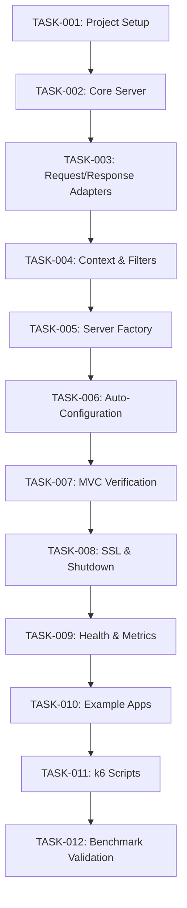

# Implementation Tasks: Netty Loom Spring Boot Starter

**Created:** 2026-01-08
**Architecture Reference:** ./ARCHITECTURE.md

## Task Overview
- **Total Tasks:** 12
- **Status:** 5/12 completed

---

## Phase 1: Foundation

### TASK-001: Project Structure & Dependencies
- **Status:** COMPLETED
- **Priority:** HIGH
- **Depends On:** None
- **Description:**
  Set up the complete multi-module project structure with all 6 modules and configure dependencies for each. This establishes the foundation for all subsequent development.
- **Acceptance Criteria:**
  - [x] settings.gradle.kts includes all 6 modules
  - [x] Each module has build.gradle.kts with correct dependencies
  - [x] Project compiles successfully with `./gradlew build`
  - [x] Empty source directories exist for each module
- **Files to Create/Modify:**
  - `settings.gradle.kts` (modify)
  - `build.gradle.kts` (modify - add version catalog)
  - `netty-loom-spring-boot-starter/build.gradle.kts` (create)
  - `netty-loom-spring-example-netty/build.gradle.kts` (create)
  - `netty-loom-spring-example-tomcat/build.gradle.kts` (create)
  - `netty-loom-spring-benchmark/build.gradle.kts` (create)

---

### TASK-002: Core Netty Server with Virtual Threads
- **Status:** COMPLETED
- **Priority:** HIGH
- **Depends On:** TASK-001
- **Description:**
  Implement the core Netty HTTP server that accepts connections, processes requests on virtual threads, and returns responses. This is the foundation of the entire library.
- **Acceptance Criteria:**
  - [x] NettyServer starts and binds to configured port
  - [x] HTTP requests are decoded correctly
  - [x] Requests are dispatched to virtual threads
  - [x] Server responds with "Hello World" to any request
  - [x] Server stops gracefully
  - [x] Unit tests pass for server lifecycle
- **Files to Create:**
  - `netty-loom-spring-core/src/main/java/.../core/server/NettyServer.java`
  - `netty-loom-spring-core/src/main/java/.../core/server/NettyServerConfiguration.java`
  - `netty-loom-spring-core/src/main/java/.../core/executor/VirtualThreadExecutorFactory.java`
  - `netty-loom-spring-core/src/main/java/.../core/pipeline/HttpServerInitializer.java`
  - `netty-loom-spring-core/src/main/java/.../core/handler/HttpRequestHandler.java`
  - `netty-loom-spring-core/src/test/java/.../core/server/NettyServerTest.java`
- **Verification:**
  ```bash
  # Start test server, then:
  curl http://localhost:8080/any/path
  # Should return: Hello World
  ```

---

## Phase 2: Servlet Adapters

### TASK-003: HTTP Request/Response Adapters
- **Status:** COMPLETED
- **Completed:** 2026-01-08T21:15:00Z
- **Priority:** HIGH
- **Depends On:** TASK-002
- **Description:**
  Implement servlet adapters that bridge Netty's HTTP model to the Servlet API. These adapters are critical for Spring MVC compatibility.
- **Acceptance Criteria:**
  - [x] NettyHttpServletRequest correctly parses URI, headers, parameters
  - [x] NettyHttpServletRequest supports getInputStream() and getReader()
  - [x] NettyHttpServletResponse builds correct Netty response
  - [x] Response status, headers, and body are set correctly
  - [x] ParameterParser handles query strings and form data
  - [x] Unit tests achieve 90%+ coverage on adapters (79 tests passing)
- **Files to Create:**
  - `netty-loom-spring-mvc/src/main/java/.../mvc/servlet/NettyHttpServletRequest.java`
  - `netty-loom-spring-mvc/src/main/java/.../mvc/servlet/NettyHttpServletResponse.java`
  - `netty-loom-spring-mvc/src/main/java/.../mvc/servlet/NettyServletInputStream.java`
  - `netty-loom-spring-mvc/src/main/java/.../mvc/servlet/NettyServletOutputStream.java`
  - `netty-loom-spring-mvc/src/main/java/.../mvc/request/ParameterParser.java`
  - `netty-loom-spring-mvc/src/test/java/.../mvc/servlet/NettyHttpServletRequestTest.java`
  - `netty-loom-spring-mvc/src/test/java/.../mvc/servlet/NettyHttpServletResponseTest.java`

---

### TASK-004: Servlet Context & Filter Support
- **Status:** COMPLETED
- **Completed:** 2026-01-08T21:45:00Z
- **Priority:** HIGH
- **Depends On:** TASK-003
- **Description:**
  Implement the minimal ServletContext needed by Spring MVC and the filter chain adapter for executing servlet filters.
- **Acceptance Criteria:**
  - [x] NettyServletContext implements required Spring MVC methods
  - [x] Servlet and filter registration works during initialization
  - [x] FilterChainAdapter executes filters in correct order
  - [x] FilterChainAdapter terminates at DispatcherServlet
  - [x] Unit tests pass
- **Files to Create:**
  - `netty-loom-spring-mvc/src/main/java/.../mvc/servlet/NettyServletContext.java`
  - `netty-loom-spring-mvc/src/main/java/.../mvc/filter/FilterChainAdapter.java`
  - `netty-loom-spring-mvc/src/main/java/.../mvc/filter/FilterRegistrationAdapter.java`
  - `netty-loom-spring-mvc/src/test/java/.../mvc/servlet/NettyServletContextTest.java`
  - `netty-loom-spring-mvc/src/test/java/.../mvc/filter/FilterChainAdapterTest.java`

---

## Phase 3: Spring Boot Integration

### TASK-005: Spring Boot Server Factory
- **Status:** COMPLETED
- **Completed:** 2026-01-09T00:30:00Z
- **Priority:** HIGH
- **Depends On:** TASK-004
- **Description:**
  Implement the Spring Boot integration layer: factory that creates the server, WebServer wrapper, configuration properties, and the bridge handler that connects Netty to Spring MVC.
- **Acceptance Criteria:**
  - [x] NettyServletWebServerFactory creates working WebServer
  - [x] NettyWebServer implements WebServer interface correctly
  - [x] NettyServerProperties binds from application.properties
  - [x] SpringMvcBridgeHandler dispatches requests to DispatcherServlet
  - [x] Virtual threads are used for all request processing
- **Files Created:**
  - `netty-loom-spring-boot-starter/src/main/java/.../autoconfigure/NettyServletWebServerFactory.java`
  - `netty-loom-spring-boot-starter/src/main/java/.../autoconfigure/NettyServerProperties.java`
  - `netty-loom-spring-boot-starter/src/main/java/.../autoconfigure/handler/SpringMvcBridgeHandler.java`
  - `netty-loom-spring-core/src/main/java/.../core/server/NettyWebServer.java`
- **Files Modified:**
  - `netty-loom-spring-core/src/main/java/.../core/server/NettyServer.java` (handler injection)
  - `netty-loom-spring-core/src/main/java/.../core/pipeline/HttpServerInitializer.java` (handler parameter)
  - `netty-loom-spring-mvc/src/main/java/.../mvc/servlet/NettyServletContext.java` (SessionCookieConfig)
  - `netty-loom-spring-mvc/src/main/java/.../mvc/filter/FilterRegistrationAdapter.java` (matches method)

---

### TASK-006: Auto-Configuration
- **Status:** PENDING
- **Priority:** HIGH
- **Depends On:** TASK-005
- **Description:**
  Create Spring Boot auto-configuration that automatically enables the Netty server when the starter is on the classpath and Tomcat is excluded.
- **Acceptance Criteria:**
  - [ ] Auto-configuration activates when Netty classes present
  - [ ] Auto-configuration disabled when Tomcat present
  - [ ] Spring Boot application starts with Netty server
  - [ ] @RestController responds to HTTP requests
  - [ ] JSON serialization works with Jackson
  - [ ] Integration test validates full flow
- **Files to Create:**
  - `netty-loom-spring-boot-starter/src/main/java/.../autoconfigure/NettyServerAutoConfiguration.java`
  - `netty-loom-spring-boot-starter/src/main/resources/META-INF/spring/org.springframework.boot.autoconfigure.AutoConfiguration.imports`
  - `netty-loom-spring-boot-starter/src/test/java/.../autoconfigure/NettyServerAutoConfigurationTest.java`
  - `netty-loom-spring-boot-starter/src/test/java/.../autoconfigure/NettyServerIntegrationTest.java`
- **Verification:**
  ```java
  @SpringBootApplication
  public class TestApp {
      @RestController
      static class TestController {
          @GetMapping("/test")
          public Map<String, String> test() {
              return Map.of("status", "ok");
          }
      }
  }
  // curl localhost:8080/test → {"status":"ok"}
  ```

---

## Phase 4: MVC Compatibility Testing

### TASK-007: Full MVC Feature Verification
- **Status:** PENDING
- **Priority:** MEDIUM
- **Depends On:** TASK-006
- **Description:**
  Comprehensive testing of Spring MVC features to ensure compatibility with existing applications. Create integration tests for each major feature.
- **Acceptance Criteria:**
  - [ ] @PathVariable works correctly
  - [ ] @RequestParam works with all types
  - [ ] @RequestBody deserializes JSON correctly
  - [ ] @ResponseBody serializes JSON correctly
  - [ ] @ExceptionHandler catches exceptions
  - [ ] @ControllerAdvice applies globally
  - [ ] HandlerInterceptor preHandle/postHandle/afterCompletion work
  - [ ] Servlet filters execute in order
  - [ ] Content negotiation works
- **Files to Create:**
  - `netty-loom-spring-boot-starter/src/test/java/.../integration/MvcAnnotationsTest.java`
  - `netty-loom-spring-boot-starter/src/test/java/.../integration/ExceptionHandlingTest.java`
  - `netty-loom-spring-boot-starter/src/test/java/.../integration/InterceptorTest.java`
  - `netty-loom-spring-boot-starter/src/test/java/.../integration/FilterTest.java`

---

## Phase 5: Production Features

### TASK-008: SSL/TLS & Graceful Shutdown
- **Status:** PENDING
- **Priority:** MEDIUM
- **Depends On:** TASK-007
- **Description:**
  Implement production-critical features: SSL/TLS support for HTTPS and graceful shutdown that allows in-flight requests to complete.
- **Acceptance Criteria:**
  - [ ] SslContextFactory creates valid SSL context from properties
  - [ ] HTTPS connections work with configured certificates
  - [ ] Graceful shutdown stops accepting new connections
  - [ ] In-flight requests complete within timeout
  - [ ] Server reports clean shutdown
  - [ ] Tests validate both features
- **Files to Create:**
  - `netty-loom-spring-core/src/main/java/.../core/ssl/SslContextFactory.java`
  - `netty-loom-spring-core/src/test/java/.../core/ssl/SslContextFactoryTest.java`
  - `netty-loom-spring-boot-starter/src/test/java/.../integration/SslTest.java`
  - `netty-loom-spring-boot-starter/src/test/java/.../integration/GracefulShutdownTest.java`

---

### TASK-009: Observability (Health & Metrics)
- **Status:** PENDING
- **Priority:** MEDIUM
- **Depends On:** TASK-008
- **Description:**
  Add Spring Boot Actuator integration with health indicators and Micrometer metrics for production monitoring.
- **Acceptance Criteria:**
  - [ ] Health indicator shows server status
  - [ ] /actuator/health includes netty component
  - [ ] Metrics track request count, latency, errors
  - [ ] Metrics integrate with Micrometer
  - [ ] Request logging is configurable
- **Files to Create:**
  - `netty-loom-spring-boot-starter/src/main/java/.../autoconfigure/NettyServerHealthIndicator.java`
  - `netty-loom-spring-boot-starter/src/main/java/.../autoconfigure/NettyServerMetricsAutoConfiguration.java`
  - `netty-loom-spring-boot-starter/src/test/java/.../integration/ActuatorTest.java`
- **Verification:**
  ```bash
  curl localhost:8080/actuator/health
  # Should include: "netty": {"status": "UP"}
  ```

---

## Phase 6: Examples & Benchmarks

### TASK-010: Example Applications
- **Status:** PENDING
- **Priority:** MEDIUM
- **Depends On:** TASK-009
- **Description:**
  Create two identical example applications - one using Netty-Loom, one using Tomcat - for benchmark comparison and as usage documentation.
- **Acceptance Criteria:**
  - [ ] Both apps have identical REST endpoints
  - [ ] /hello - Simple string response
  - [ ] /json - JSON serialization
  - [ ] /db - Simulated blocking DB call
  - [ ] /mixed - CPU + IO combined
  - [ ] Both apps start and respond correctly
  - [ ] README documents usage
- **Files to Create:**
  - `netty-loom-spring-example-netty/src/main/java/.../example/ExampleApplication.java`
  - `netty-loom-spring-example-netty/src/main/java/.../example/controller/ExampleController.java`
  - `netty-loom-spring-example-netty/src/main/java/.../example/service/SimulatedService.java`
  - `netty-loom-spring-example-tomcat/src/main/java/.../example/ExampleApplication.java`
  - `netty-loom-spring-example-tomcat/src/main/java/.../example/controller/ExampleController.java`
  - `netty-loom-spring-example-tomcat/src/main/java/.../example/service/SimulatedService.java`
  - `netty-loom-spring-example-netty/src/main/resources/application.yml`
  - `netty-loom-spring-example-tomcat/src/main/resources/application.yml`

---

### TASK-011: k6 Benchmark Scripts
- **Status:** PENDING
- **Priority:** MEDIUM
- **Depends On:** TASK-010
- **Description:**
  Create k6 load testing scripts that measure performance across different workload types and concurrency levels.
- **Acceptance Criteria:**
  - [ ] cpu-bound.js tests JSON serialization throughput
  - [ ] io-bound.js tests simulated DB call handling
  - [ ] mixed-workload.js combines scenarios
  - [ ] high-concurrency.js tests 10K+ connections
  - [ ] docker-compose.yml runs both apps
  - [ ] run-benchmark.sh orchestrates full comparison
  - [ ] README documents benchmark methodology
- **Files to Create:**
  - `netty-loom-spring-benchmark/scripts/cpu-bound.js`
  - `netty-loom-spring-benchmark/scripts/io-bound.js`
  - `netty-loom-spring-benchmark/scripts/mixed-workload.js`
  - `netty-loom-spring-benchmark/scripts/high-concurrency.js`
  - `netty-loom-spring-benchmark/docker-compose.yml`
  - `netty-loom-spring-benchmark/run-benchmark.sh`
  - `netty-loom-spring-benchmark/README.md`

---

### TASK-012: Benchmark Execution & Validation
- **Status:** PENDING
- **Priority:** LOW
- **Depends On:** TASK-011
- **Description:**
  Execute the benchmark suite, collect results, and validate that the 50%+ performance improvement target is achieved.
- **Acceptance Criteria:**
  - [ ] Benchmarks run successfully against both servers
  - [ ] Results document throughput (RPS) comparison
  - [ ] Results document latency (p50, p95, p99) comparison
  - [ ] Results document memory usage comparison
  - [ ] 50%+ throughput improvement verified at 10K connections
  - [ ] Results documented in BENCHMARK_RESULTS.md
- **Files to Create:**
  - `.artifacts/2026-01-08-netty-loom-spring-boot-starter/BENCHMARK_RESULTS.md`

---

## Dependency Graph



## Implementation Order

1. TASK-001: Project Structure & Dependencies
2. TASK-002: Core Netty Server with Virtual Threads
3. TASK-003: HTTP Request/Response Adapters
4. TASK-004: Servlet Context & Filter Support
5. TASK-005: Spring Boot Server Factory
6. TASK-006: Auto-Configuration
7. TASK-007: Full MVC Feature Verification
8. TASK-008: SSL/TLS & Graceful Shutdown
9. TASK-009: Observability (Health & Metrics)
10. TASK-010: Example Applications
11. TASK-011: k6 Benchmark Scripts
12. TASK-012: Benchmark Execution & Validation
