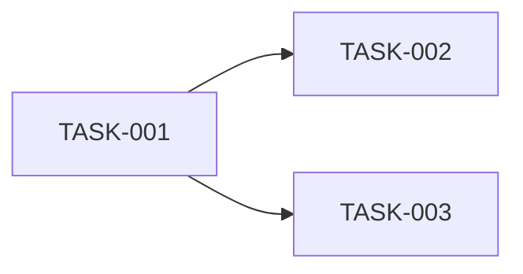

# /tasks Command - Task List Generation

Generate detailed implementation tasks from the architecture plan.

## Purpose
Break down architecture into specific, implementable tasks.

## Prerequisites
- `PLAN_APPROVED` state
- `ARCHITECTURE.md` exists

## Arguments
Optional: Specific artifact folder
$ARGUMENTS

## Quality Gate Check
Before proceeding, verify:
1. Find the most recent artifact folder (or use specified folder)
2. Read `STATE.md` and verify state is `PLAN_APPROVED`
3. Verify `ARCHITECTURE.md` exists and is complete

**If prerequisites fail, output:**
```
QUALITY GATE FAILED: /tasks requires PLAN_APPROVED state.
Current state: {current_state}
Missing: {what is missing}
Action: Please run /plan first to create an architecture plan.
```

## Process

### Step 1: Locate Artifact Folder
Find most recent or specified: `.artifacts/{date}-{feature-name}/`

### Step 2: Analyze Architecture Plan
Read `ARCHITECTURE.md` and extract:
- Implementation phases
- Components to build
- Dependencies between tasks

### Step 3: Generate Task List
Create `TASKS.md` with:
- Individual tasks with IDs
- Clear acceptance criteria for each
- Dependency ordering
- Files to modify/create

### Step 4: Create Tasks Document
Save to: `.artifacts/{date}-{feature-name}/TASKS.md`

Template:
```markdown
# Implementation Tasks: {Feature Name}

**Created:** {date}
**Architecture Reference:** ./ARCHITECTURE.md

## Task Overview
- **Total Tasks:** {N}
- **Status:** 0/{N} completed

## Tasks

### TASK-001: {Title}
- **Status:** PENDING
- **Priority:** HIGH
- **Depends On:** None
- **Description:**
  {Detailed description}
- **Acceptance Criteria:**
  - [ ] {criterion}
- **Files to Modify/Create:**
  - `{path}`

### TASK-002: {Title}
- **Status:** PENDING
- **Priority:** MEDIUM
- **Depends On:** TASK-001
{...}

## Dependency Graph


## Implementation Order
1. TASK-001: {Title}
2. TASK-002: {Title}
```

### Step 5: Update Workflow State
Update `STATE.md`:
- Set state to: `TASKLIST_READY`
- Add entry to state history

## Output Artifacts
- `TASKS.md` - Implementation task list

## Quality Criteria
- [ ] Tasks are specific and actionable
- [ ] Each task has clear acceptance criteria
- [ ] Dependencies are identified
- [ ] Implementation order is logical
- [ ] Files to modify are identified

## Next Steps
- `/implement TASK-001` - Start implementing first task

## Example Usage
```
/tasks
/tasks 2024-01-07-user-auth
```
